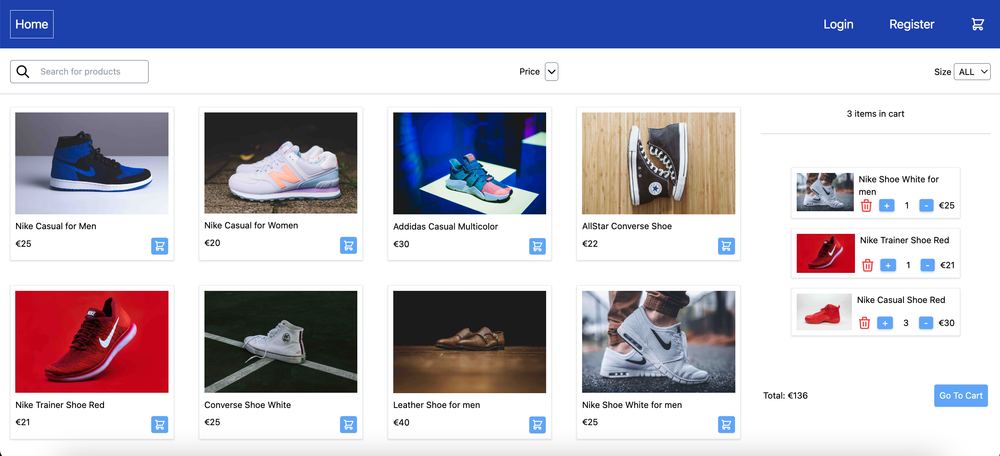

# About the app

This is a full-stack e-commerce web application. The user interface of the application can be accessed at [https://lucid-lewin-704e07.netlify.app/](https://lucid-lewin-704e07.netlify.app/). The server is hosted at [https://e-shop-express.com](https://e-shop-express.com) and uses [AWS cloud services](https://aws.amazon.com/). 

# Table of contents
  1. [About the project](#about-the-project)
      - [Built with](#built-with)
        - [Dependencies](#dependencies)

## About The Project

### Built With

The main technologies used for building and deploying the application are listed below:

- [TypeScript](https://www.typescriptlang.org/) - A programming language
- [React](https://react.dev/) - A javascript framework used to build the UI of the application 
- [Redux](https://redux.js.org/) - A javascript library used to manage the global state of the application 
- [Express.js](https://expressjs.com/) - A web framework for [Node.js](https://nodejs.org/en) used to create web API 
- [MongoDB](https://www.mongodb.com/) - An open source NoSQL database management program used to store the data of the application.
- [Docker](https://img.shields.io/badge/docker-%230db7ed.svg?style=for-the-badge&logo=docker&logoColor=white)  - A software used to build, test, and deploy applications.
- [AWS](https://aws.amazon.com/) - A platform that offers cloud computing services including deploying web applications

#### Dependencies
 - [Mongoose.js](https://mongoosejs.com/) -  An Object Data Modeling (ODM) library for MongoDB and Node.js. 
 - [Passport.js](https://www.passportjs.org/) - An authentication middleware for Node.js used to authenticate requests through an extensible set of plugins known as strategies. 
 - [Superstruct](https://docs.superstructjs.org/) - A typescript library designed for validating data at runtime, so it throws (or returns) detailed runtime errors to the end users. 
 - [Jest](https://jestjs.io/) - A javascript testing framework that works with projects including React and Node.js
 - [Supertest](https://github.com/ladjs/supertest) - A Node.js library used to test APIs.

## Getting started
To get the full-stack application running locally follow these steps:
- Clone this repository
- Install MongoDB (https://www.mongodb.com/docs/manual/installation/)
- Install docker (https://docs.docker.com/get-docker/)
- Create a free account in [sendgrid](https://sendgrid.com/) and follow the instructions to generate API key (https://docs.sendgrid.com/for-developers/sending-email/api-getting-started). This key should be added to env variables when running the express server.

To run the frontend application:
- `npm install` in the root folder
- `docker compose up -d` to start the application
- `docker compose down` to close the application

To run the express server:
- `cd server` to enter the project folder
- Create `.dev.env` file in the project folder and fill out the values for the variables. You can find the an example file `dev.env.example` in the project folder.
- `docker compose up -d` to start the server
- `docker compose down` to shut the server

